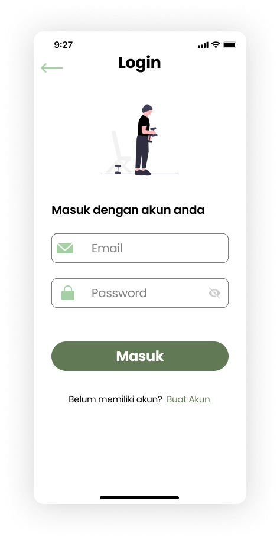
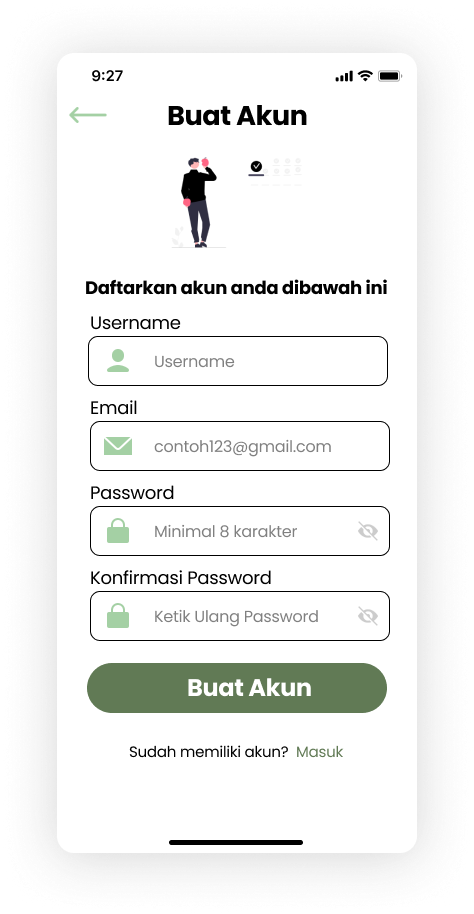
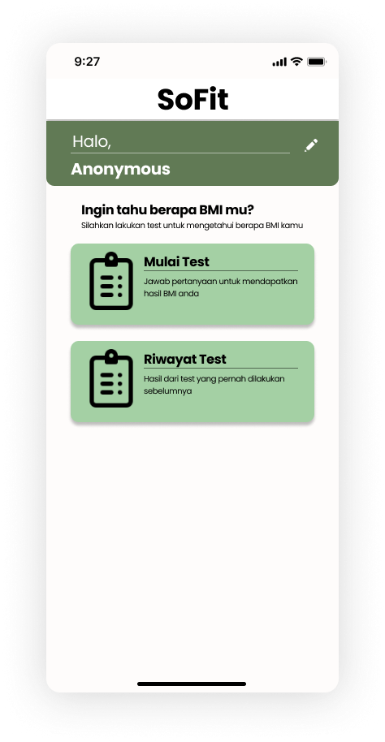
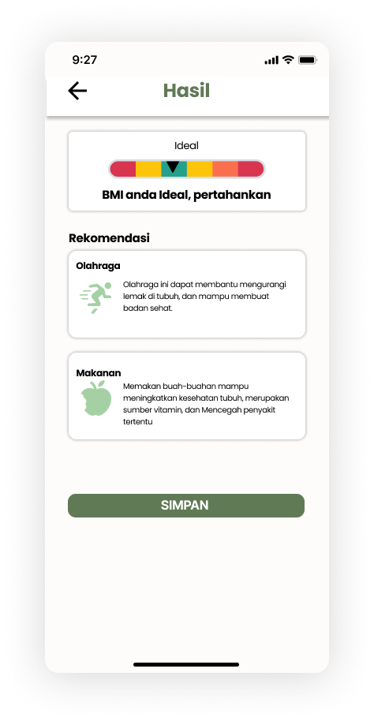
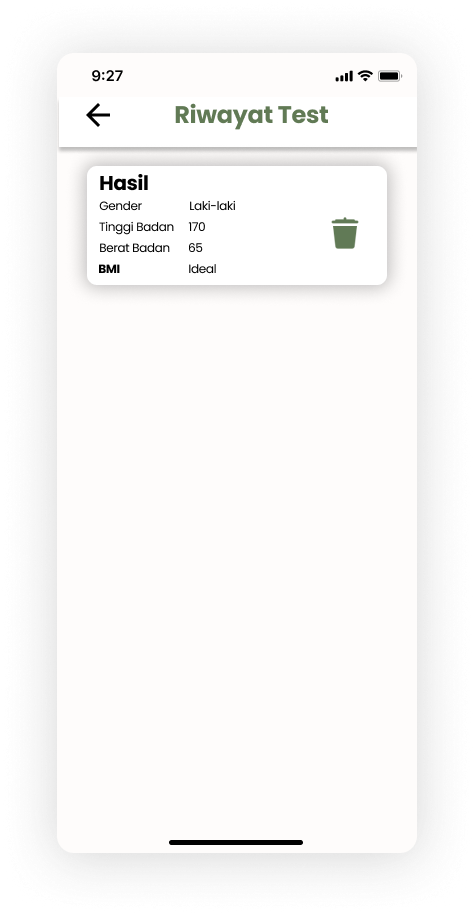
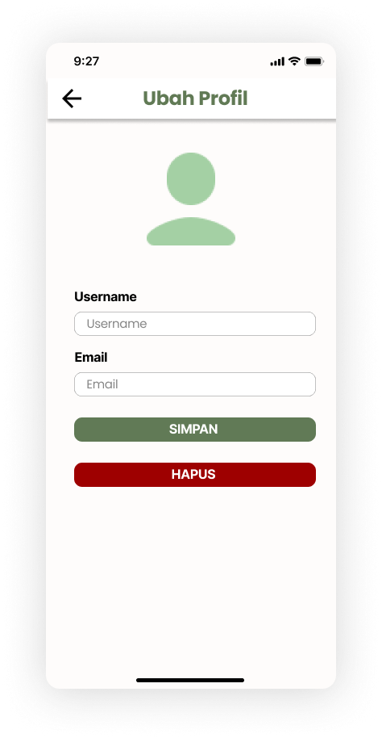

# Body Mass Index App SoFit By C23-PS233 Capstone Project Bangkit 2023 #


# About 
Application for the health of your body and provide recommendations based on your BMI.

## Requirements

To run the Kotlin APK, you need:

- An Android device or emulator running Android OS.
- Kotlin SDK and build tools installed on your development environment.
- Android Studio or another compatible IDE.

## Setup and Installation

1. Clone the repository:

   ```
   git clone https://github.com/sofit-c23-ps233/SoFit-androidApp.git
   ```

2. Open the project in your preferred IDE (e.g., Android Studio).

3. Connect your Android device or start an emulator.
   
4. Build and run the application from your IDE, targeting the connected device or emulator.
   
5. Explore the different features of the Kotlin APK within the application's user interface.


## License

This project is licensed under the [MIT License](LICENSE). You are free to use, modify, and distribute this software as per the terms of this license.

# github our team #
> link below
[[here]](https://github.com/sofit-c23-ps233)

# Design UI
 
          

# Download APK Here
Run App by installing our pre-build apk [here](https://website-dot-sofit-cloud.et.r.appspot.com/). (updated 14 June 2023)
